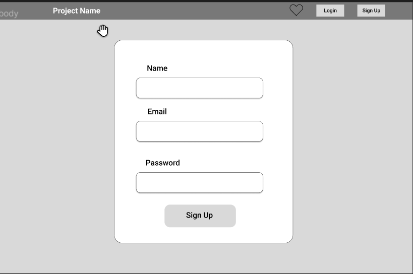

# Wander Hands

## Description
The project aims to create an online platform that facilitates volunteering across different countries. This platform will connect individuals seeking volunteering opportunities with organizations and projects worldwide that need assistance. By bridging the gap between volunteers and projects, the platform seeks to promote cultural exchange, social impact, and personal growth.

## Wireframes

## User Stories
1. **Browse Volunteer Opportunities**
   - User Story: As a potential volunteer, I want to see a list of available volunteering opportunities, so I can choose the one that matches my interests and skills.
   - Feature Tasks:
     - Create a page to display a list of volunteer opportunities.
     - Implement a filter to sort opportunities based on location, duration, and type of work.
   - Acceptance Tests:
     - When I visit the "Volunteer Opportunities" page, I should see a list of opportunities.
     - I can use filters to narrow down the opportunities based on my preferences.

2. **Apply for a Volunteering Opportunity**
   - User Story: As a registered user, I want to view the details of a specific volunteering opportunity and apply for it.
   - Feature Tasks:
     - Show detailed information about each volunteering opportunity.
     - Add a button to apply for a specific opportunity.
   - Acceptance Tests:
     - When I click on a volunteer opportunity, I should see its details.
     - I can click on the "Apply" button to submit my application for that opportunity.

## Software Requirements

- **Functional Requirements:**
  - User registration and login system.
  - Volunteer opportunity listing and details display.
  - Application submission functionality.
  - Filters for searching opportunities.
  - User profile management.

- **Non-functional Requirements:**
  - Responsive design for mobile and desktop.
  - Secure authentication and data storage.
  - High-performance server and database hosting.
  - Multilingual support for a global audience.

## Database Schema Diagram

## Technologies Used
- Django
- SQLite
- Next.js